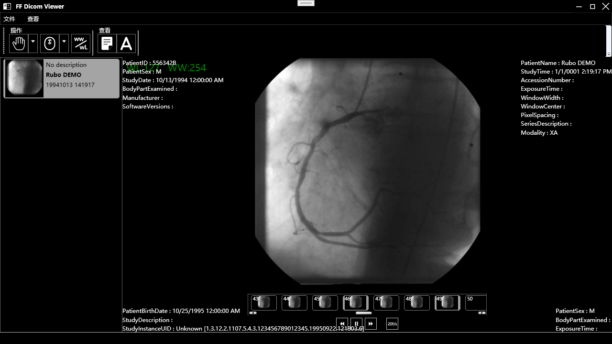

# ImageViewer
Dicom Image Viewer

Medical image display control,support dicom/raw image.

## Screenshots

# Features
* Support dicom/raw files
* Windows Width/window Level display
* Zoom Out/In

## Roadmap

* SetWindow
* Text tool
* Annotation
* Histgram

## License
[GPLv3](LICENSE)

